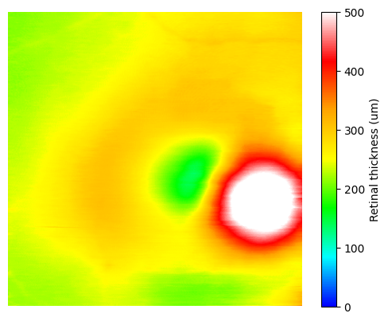
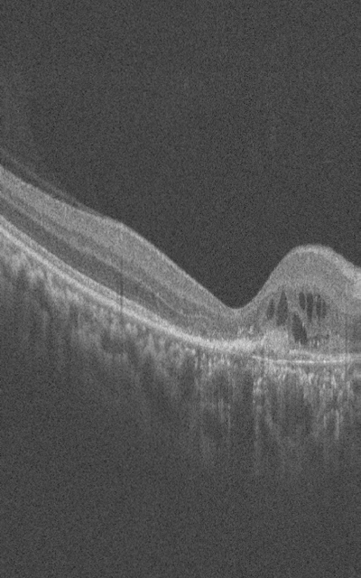

# OCT ILM/BM Segmentation with nnU-Net

Pretrained nnU-Net model for segmentation of the internal limiting membrane (ILM) and Bruch's membrane (BM) in retinal optical coherence tomography (OCT) images.



*Example retinal thickness map derived from the segmented ILM and BM boundaries.*

## Overview

The models were trained using the [OCTA-500 dataset](https://ieee-dataport.org/open-access/octa-500). The study used the 6 × 6 mm<sup>2</sup> OCT subset from 300 eyes, following the standard split of 240 eyes for training, 10 for validation, and 50 for testing. Only the ILM and BM reference annotations were used for model training.

## Use in the associated study

Both released models were used as components of the study [Deep learning strategies for estimating retinal thickness from fundus images: a comparative study with multi-device data](https://www.nature.com/articles/s41598-026-51728-z).

The two nnU-Net models were trained on OCTA-500 and applied to 6 × 6 mm<sup>2</sup> macular OCT scans acquired with Topcon Maestro2 and Triton in AI-READI (version 2.0.0). Neither model was fine-tuned on AI-READI. Post-processing was applied to remove incorrect segmentation labels from each model output.

The post-processed ILM/BM segmentations from both models were converted into total retinal thickness (TRT) maps. For each OCT scan, these two model-derived maps were visually compared with a third TRT map derived from the segmentation provided by the OCT device. The highest-quality map among the three was selected for use in the study. This release covers the nnU-Net segmentation component of that work.

## Getting started

### 1. Install nnU-Net

Use the official [nnU-Net repository](https://github.com/MIC-DKFZ/nnUNet) and follow its [installation and setup guide](https://github.com/MIC-DKFZ/nnUNet/blob/master/documentation/getting-started/installation-and-setup.md) for environment setup.

Follow the linked guide to install PyTorch and nnU-Net and configure storage paths, including `nnUNet_results`.

### 2. Download the pretrained model

Download the two model packages from [Hugging Face: RayWangLab/oct-ilm-bm-segmentation-nnunet](https://huggingface.co/RayWangLab/oct-ilm-bm-segmentation-nnunet):

| Package | Input format recorded in dataset.json | Configuration |
| --- | --- | --- |
| `Dataset001_OCT-Layer-2d-TR.zip` | OCT B-scan, `.png` | `2d` |
| `Dataset002_OCT-Layer-3d2d-TR.zip` | OCT volume, `.nii.gz` | `2d` |

After setting up a compatible nnU-Net v2 environment, run the command for the package you downloaded from the directory containing the ZIP:

```bash
nnUNetv2_install_pretrained_model_from_zip Dataset001_OCT-Layer-2d-TR.zip
```

```bash
nnUNetv2_install_pretrained_model_from_zip Dataset002_OCT-Layer-3d2d-TR.zip
```

Model packages and sample files: [Files and versions on Hugging Face](https://huggingface.co/RayWangLab/oct-ilm-bm-segmentation-nnunet/tree/main).

### 3. Prepare the sample B-scans

Follow the [sample guide](examples/README.md) to obtain one volume per model from Hugging Face: 400 PNG inputs for Dataset001 and one NIfTI input for Dataset002, with corresponding reference labels.

### 4. Run inference

See the official [nnU-Net inference guide](https://github.com/MIC-DKFZ/nnUNet/blob/master/documentation/how-to/run-inference.md) for prediction options.

Use the following command form:

```bash
nnUNetv2_predict -i INPUT_FOLDER -o OUTPUT_FOLDER -d DATASET_NAME_OR_ID -c 2d -f 0 -tr nnUNetTrainer_250epochs
```

Set `DATASET_NAME_OR_ID` to `001` for `Dataset001_OCT-Layer-2d-TR` or `002` for `Dataset002_OCT-Layer-3d-TR`.

For Dataset001:

```bash
nnUNetv2_predict -i INPUT_FOLDER -o OUTPUT_FOLDER -d 001 -c 2d -f 0 -tr nnUNetTrainer_250epochs
```

For Dataset002:

```bash
nnUNetv2_predict -i INPUT_FOLDER -o OUTPUT_FOLDER -d 002 -c 2d -f 0 -tr nnUNetTrainer_250epochs
```

Replace `INPUT_FOLDER` with the matching `images/` directory and `OUTPUT_FOLDER` with a new directory for predictions. Do not use the `labels/` directory as input.

These commands explicitly select configuration `2d`, fold `0`, and trainer `nnUNetTrainer_250epochs`, matching the exported archives.

### 5. Inspect the results

Both models define a binary output: `0 = background` and `1 = tissue`. The example below shows an OCT B-scan and its corresponding binary tissue label. For visualization, the label values are displayed as `0 = black` and `1 = white`.

| OCT B-scan input | Binary tissue label |
| --- | --- |
|  |  |
| `10241-200_0000.png` | `10241-200.png` (`0 = black`, `1 = white`) |

## Examples

See [examples/README.md](examples/README.md) for the sample layout. Sample binaries are maintained with the models on Hugging Face; this GitHub repository contains instructions only. Public redistribution clearance is pending.

## Citation

If you use this model, please cite:

Takahashi, N., Gadiraju, N., Kim, J. E., & Wang, J.-K. (2026). Deep learning strategies for estimating retinal thickness from fundus images: a comparative study with multi-device data. *Scientific Reports*, **16**, 22301. https://doi.org/10.1038/s41598-026-51728-z

Please also follow the citation guidance in the [nnU-Net repository](https://github.com/MIC-DKFZ/nnUNet#citation).

## License

The two model packages, `Dataset001_OCT-Layer-2d-TR.zip` and `Dataset002_OCT-Layer-3d2d-TR.zip`, are licensed under the [Creative Commons Attribution-NonCommercial 4.0 International License (CC BY-NC 4.0)](https://creativecommons.org/licenses/by-nc/4.0/).
